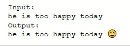
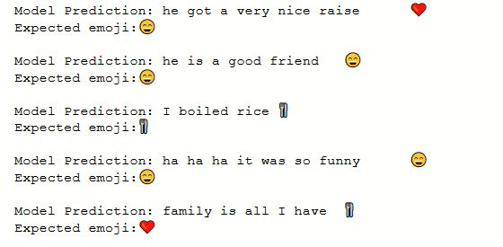
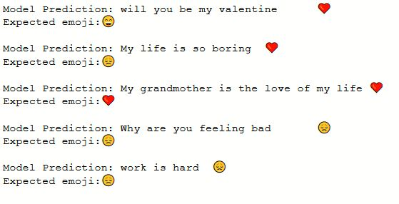

# Deep Emoji
Express your words with the power of Emoji.  
Using a deep **LSTM network** the model associates an english input sentence with an emoji. **GLoVe**  was 
used in the model since the dataset on which it was trained on was very very small. 

Here is a snapshot. 

## Model Predictions

 GLoVe file **"glove.6B.50d"** can be downloaded from https://nlp.stanford.edu/projects/glove/
### Credits
1. This project is based on the assignment from Sequence Models Specialization by Deeplearning.ai on Coursera.
https://www.coursera.org/learn/nlp-sequence-models/home/welcome.
2. Jeffrey Pennington, Richard Socher, and Christopher D. Manning. 2014. GloVe: Global Vectors for Word Representation. [pdf](https://nlp.stanford.edu/pubs/glove.pdf) [bib](https://nlp.stanford.edu/pubs/glove.bib)

